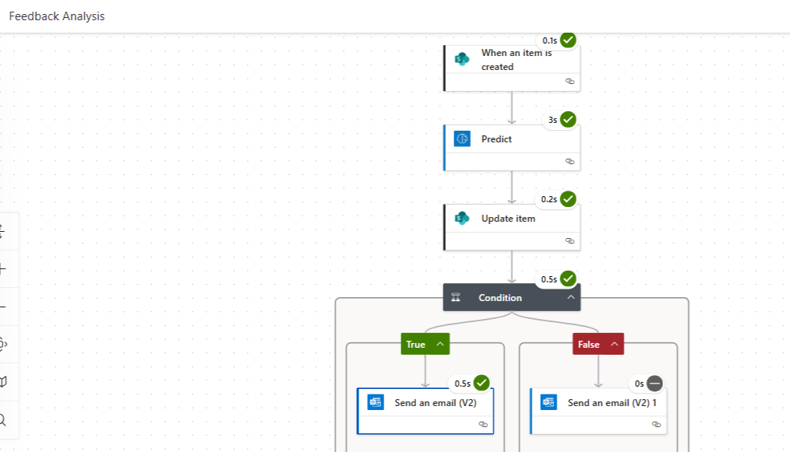

# Overview

The Feedback Analysis flow automates sentiment detection for feedback submitted via a SharePoint list.
When a new feedback item is created, the flow uses AI Builder Sentiment Analysis (Predict) to classify the feedback as Positive, Neutral, or Negative.
Based on the sentiment result, the system:
1. Updates the SharePoint list with sentiment values
2. Sends an email notification to the respective recipient

---

## 🚀 Features
1. When an item is created (SharePoint)
Triggered whenever a new feedback entry is added to the Feedback List in SharePoint.

2. Predict (AI Builder – Sentiment Analysis)
Input: Feedback text from SharePoint list

Output: Sentiment result (Positive, Negative, Neutral) and confidence scores

2. Update Item (SharePoint)
Updates the SharePoint list item with sentiment analysis results (e.g., Sentiment column updated with “Positive/Negative/Neutral”).

3. Condition (Control)
- Checks if the detected sentiment is Positive/Neutral.
a. Send an email (V2)- Sends a thank-you or acknowledgment email
- If Negative
b. Send an email (V2) - Sends an alert email to manager/stakeholder and response to user "We are sorry for your experience"

---

## Workflow Screenshot

## 🛠️ Prerequisites

- Access to Power Automate with AI Builder capacity/trial
- A SharePoint list with a text column for feedback
- Outlook connector with “Send an email (V2)” permission
- AI Builder prebuilt Sentiment Analysis prompt

---

## 📌 Example Use Cases

- Customer service teams monitoring negative feedback
- HR teams analyzing employee survey responses
- Product feedback collection for improvement tracking

## 📄 License
This project is licensed under the MIT License.  
